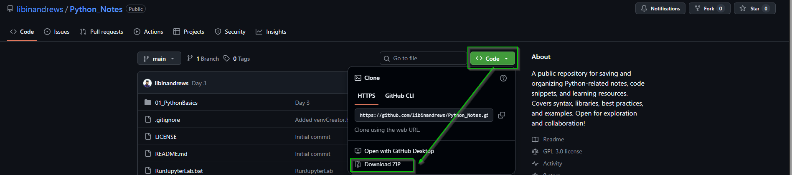

# Python Notes 🐍

A public repository for saving and organizing Python-related notes, code snippets, and learning resources. This collection covers essential syntax, popular libraries, best practices, and practical examples. It's structured as a personal knowledge base and is open for exploration and collaboration!

## 📂 Repository Structure

*   **`01_PythonBasics/`**: Foundational Python concepts.
*   **`attachments/`**: Contains images and screenshots used in the documentation.
*   **`RunJupyterLab.bat`**: A convenient batch script to launch JupyterLab directly.
*   **`venvCreator.bat`**: A batch script to automate the creation of a Python virtual environment.
*   **`.gitignore`**: Configured to exclude unnecessary files (like the `venv/` folder) from version control.
*   **`LICENSE`**: The open-source license for this project.
*   **`README.md`**: This file.

## 🚀 Getting Started

You can get a local copy of these notes up and running in two simple ways:

### Option 1: Download as ZIP (Quickest)
1.  Click the green **"Code"** button near the top of this page.
2.  Select **"Download ZIP"** from the dropdown menu.



4.  Extract the downloaded ZIP file to a folder on your computer.

### Option 2: Clone the Repository (For Git users)
If you have Git installed, open your terminal or command prompt and run:

```bash
git clone https://github.com/libinandrews/Python_Notes.git
cd Python_Notes
```

## ⚙️ Setting Up Your Environment

To run the Jupyter notebooks, you'll need a Python environment with the necessary packages. This repository includes helper scripts to make this easy.

**Prerequisites:** Ensure you have [Python](https://www.python.org/downloads/) (3.7 or later) installed on your system.

### Using the Helper Scripts (Windows)
1.  **Create a Virtual Environment:** Double-click the `venvCreator.bat` file. This will create an isolated Python environment named `venv` in the project folder.
2.  **Launch JupyterLab:** Once the environment is created, double-click `RunJupyterLab.bat`. This script will activate the environment and start JupyterLab in your default web browser.

### Manual Setup (All Operating Systems)
1.  **Navigate** to the project directory in your terminal.
2.  **Create a virtual environment** (recommended):
    ```bash
    python -m venv venv
    ```
3.  **Activate the environment**:
    *   On Windows: `venv\Scripts\activate`
    *   On macOS/Linux: `source venv/bin/activate`
4.  **Install required packages** (if a `requirements.txt` file is added later):
    ```bash
    pip install -r requirements.txt
    ```
    *(For now, you may need to install packages like `jupyter` manually as you use the notebooks.)*
5.  **Launch Jupyter**:
    ```bash
    jupyter notebook
    ```
    or
    ```bash
    jupyter lab
    ```

## 💡 How to Use
Once Jupyter is running, navigate through the folders (e.g., `01_PythonBasics/`) and open any `.ipynb` notebook file to view the notes and run the code examples interactively.

## 🤝 Contributing
This repository is open for exploration and collaboration! Feel free to:
*   Fork the project.
*   Open an issue to discuss improvements or suggestions.
*   Submit a pull request with your own notes, snippets, or corrections.

## 📄 License
This project is licensed under the **GNU General Public License (GPL)** – see the [LICENSE](LICENSE) file for details.
---

Happy Learning! ✨
